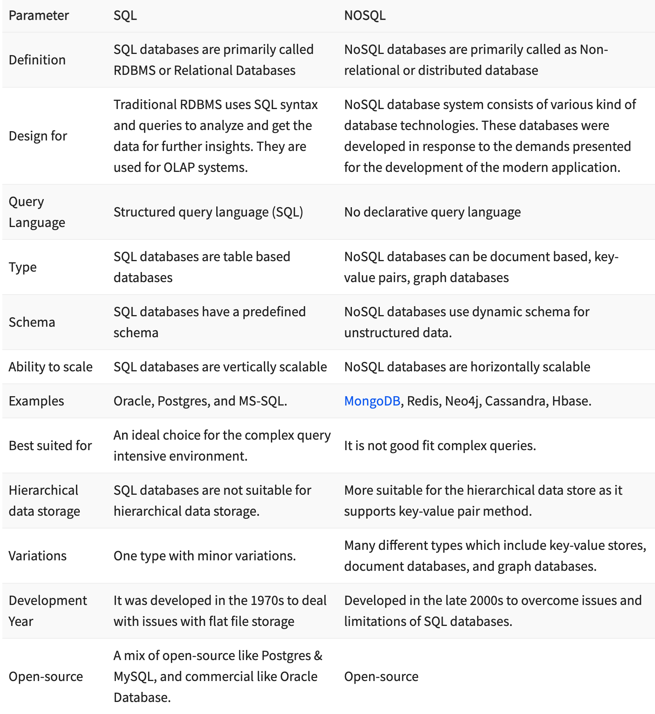

# Compare and contrast the SQL and Non-SQL solution

## SQL vs NoSQL:
**SQL**: is the programming language used to interface with relational databases. (Relational databases model data as records in rows and tables with logical links between them).
**NoSQL**: is a class of DBMs that are non-relational and generally do not use SQL.

**SQL** has been around for over 40 years, so it is recognizable, documented, and widely-used. Safe and versatile.

#### For Strucure:
**SQL** database schemata always represent relational, tabular data, with rules about consistency and integrity. They contain tables with columns (attributes) and rows (records), and keys have constrained logical relationships.

**NoSQL** databases need not stick to this format, but generally fit into one of four broad categories:

`Column-oriented` databases transpose `row-oriented` RDBMSs, allowing efficient storage of high-dimensional data and individual records with varying attributes.
`Key-Value` stores are dictionaries which access diverse objects with a key unique to each.
Document stores hold semi-structured data: objects which contain all of their own relevant information, and which can be completely different from each other.
Graph databases add the concept of relationships (direct links between objects) to documents, allowing rapid traversal of greatly connected data sets.

## The five critical differences between SQL vs NoSQL are:

 1- SQL databases are relational, NoSQL databases are non-relational.
 2- SQL databases use structured query language and have a predefined schema. NoSQL databases have dynamic schemas for unstructured data.
 3- SQL databases are vertically scalable, while NoSQL databases are horizontally scalable.
 4- SQL databases are table-based, while NoSQL databases are document, key-value, graph, or wide-column stores.
 5- SQL databases are better for multi-row transactions, while NoSQL is better for unstructured data like documents or JSON.

## Database Schemas and Query Languages:

SQL databases use structured query language and have a pre-defined schema for defining and manipulating data. SQL is one of the most versatile and widely used query languages available, making it a safe choice for many use cases. It’s perfect for complex queries. However, SQL can be too restrictive. You have to use predefined schemas to determine your data structure before you can work with it. All of your data must follow the same structure. This process requires significant upfront preparation. If you ever wanted to change your data structure, it would be difficult and disruptive to your whole system. 

NoSQL databases have dynamic schemas for unstructured data, and the data is stored in many ways. You can use column-oriented, document-oriented, graph-based, or KeyValue store for your data. This flexibility means that: 

You can create documents without having to first define their structure
Each document can have its own unique structure
The syntax can vary from database to database
You can add fields as you go
Database Scaling 
SQL databases are vertically scalable in most situations. You’re able to increase the load on a single server by adding more CPU, RAM, or SSD capacity. NoSQL databases are horizontally scalable. You’re able to handle higher traffic by sharding, which adds more servers to your NoSQL database. Horizontal scaling has a greater overall capacity than vertical scaling, making NoSQL databases the preferred choice for large and frequently changing data sets. 

## Data Structure:

SQL databases are table-based, while NoSQL databases are document, key-value, graph, or wide-column stores. 

Some examples of SQL databases include MySQL, Oracle, PostgreSQL, and Microsoft SQL Server. NoSQL database examples include MongoDB, BigTable, Redis, RavenDB Cassandra, HBase, Neo4j, and CouchDB.

;

#### References:
[integrate](https://www.integrate.io/blog/the-sql-vs-nosql-difference/)
[guru99](https://www.guru99.com/sql-vs-nosql.html)
[talend](https://www.talend.com/resources/sql-vs-nosql/#:~:text=SQL%20is%20the%20programming%20language,generally%20do%20not%20use%20SQL.)